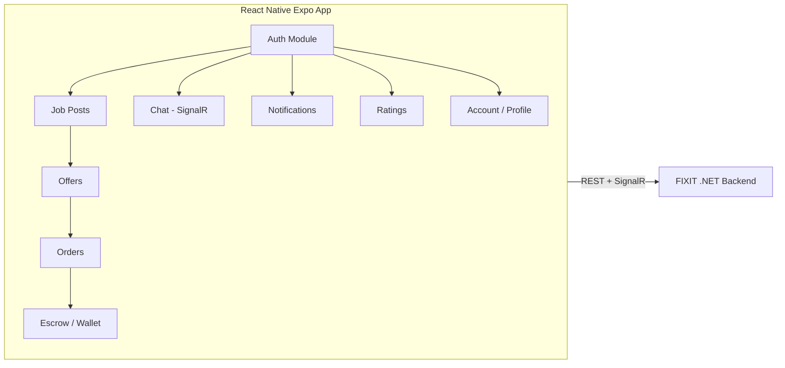
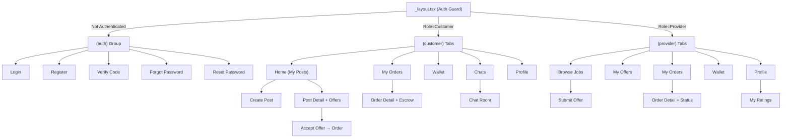

# FIXIT Mobile App — Full Implementation Plan

## 1. System Overview

FIXIT is a home-services marketplace. **Customers** post jobs, **Providers** bid with offers, and the platform manages escrow payments, real-time chat, notifications, and ratings.



---

## 2. Tech Stack & Project Setup

| Layer | Technology |
|---|---|
| Framework | React Native + **Expo SDK 52+** |
| Navigation | `expo-router` (file-based) |
| State | Zustand (lightweight global store) |
| HTTP | Axios with interceptors |
| Real-time | `@microsoft/signalr` |
| Forms | React Hook Form + Zod |
| Image Picker | `expo-image-picker` |
| Secure Storage | `expo-secure-store` |
| Notifications | `expo-notifications` |
| Maps | `react-native-maps` |

### Init Command

```bash
npx -y create-expo-app@latest ./FIXIT-Mobile --template blank
cd FIXIT-Mobile
npx expo install expo-router expo-secure-store expo-image-picker expo-notifications react-native-maps
npm install axios zustand @microsoft/signalr react-hook-form zod @hookform/resolvers
```

---

## 3. Folder Structure

```
src/
├── app/                    # expo-router screens
│   ├── (auth)/
│   │   ├── login.tsx
│   │   ├── register.tsx
│   │   ├── verify-code.tsx
│   │   ├── forgot-password.tsx
│   │   └── reset-password.tsx
│   ├── (customer)/
│   │   ├── _layout.tsx     # Bottom tabs
│   │   ├── home.tsx        # Job posts feed
│   │   ├── create-post.tsx
│   │   ├── post/[id].tsx   # Post detail + offers
│   │   ├── orders.tsx
│   │   ├── order/[id].tsx  # Order detail + escrow actions
│   │   ├── wallet.tsx
│   │   └── profile.tsx
│   ├── (provider)/
│   │   ├── _layout.tsx     # Bottom tabs
│   │   ├── feed.tsx        # Browse job posts
│   │   ├── my-offers.tsx
│   │   ├── orders.tsx
│   │   ├── order/[id].tsx
│   │   ├── wallet.tsx
│   │   ├── ratings.tsx
│   │   └── profile.tsx
│   ├── (shared)/
│   │   ├── chat/index.tsx        # Chat list
│   │   ├── chat/[chatId].tsx     # Chat conversation
│   │   └── notifications.tsx
│   └── _layout.tsx         # Root layout + auth guard
├── api/
│   ├── client.ts           # Axios instance + interceptors
│   ├── auth.ts
│   ├── jobPost.ts
│   ├── offer.ts
│   ├── order.ts
│   ├── escrow.ts
│   ├── wallet.ts
│   ├── chat.ts
│   ├── notification.ts
│   ├── rating.ts
│   └── account.ts
├── store/
│   ├── authStore.ts
│   ├── chatStore.ts
│   └── notificationStore.ts
├── services/
│   └── signalr.ts          # SignalR connection manager
├── components/             # Reusable UI components
├── hooks/                  # Custom hooks
├── types/                  # TypeScript interfaces
│   ├── auth.ts
│   ├── jobPost.ts
│   ├── offer.ts
│   ├── order.ts
│   ├── wallet.ts
│   ├── chat.ts
│   ├── notification.ts
│   └── rating.ts
├── utils/
│   ├── storage.ts          # SecureStore helpers
│   └── constants.ts
└── theme/
    └── index.ts            # Colors, spacing, typography
```

---

## 4. API Client Setup

```typescript
// src/api/client.ts
import axios from 'axios';
import * as SecureStore from 'expo-secure-store';

const BASE_URL = 'https://your-api-domain.com';

const api = axios.create({ baseURL: BASE_URL });

// Request interceptor — attach JWT
api.interceptors.request.use(async (config) => {
  const token = await SecureStore.getItemAsync('accessToken');
  if (token) config.headers.Authorization = `Bearer ${token}`;
  return config;
});

// Response interceptor — auto refresh on 401
api.interceptors.response.use(
  (res) => res,
  async (error) => {
    if (error.response?.status === 401) {
      const refreshToken = await SecureStore.getItemAsync('refreshToken');
      const { data } = await axios.post(`${BASE_URL}/Auth/RefreshToken`, null, {
        headers: { Cookie: `refreshToken=${refreshToken}` }
      });
      if (data.isAuthenticated) {
        await SecureStore.setItemAsync('accessToken', data.token);
        await SecureStore.setItemAsync('refreshToken', data.refreshToken);
        error.config.headers.Authorization = `Bearer ${data.token}`;
        return api(error.config);
      }
    }
    return Promise.reject(error);
  }
);

export default api;
```

> [!IMPORTANT]
> The backend sends `refreshToken` via HttpOnly cookie. On mobile, cookies don't persist between sessions. Store the refresh token in `expo-secure-store` and send it manually in the `Cookie` header or as a request body field. You may need a small backend change to also accept the refresh token from the request body.

---

## 5. TypeScript Interfaces

```typescript
// src/types/auth.ts
export interface RegisterDTO {
  name: string;           // letters only, min 3
  userName: string;       // alphanumeric, min 10
  email: string;
  password: string;       // alphanumeric, min 10
  phone: string;          // digits only
  role: 0 | 1;            // 0=Customer, 1=Provider
  latitude: number;
  longitude: number;
}

export interface LoginDTO {
  userName: string;
  password: string;
}

export interface AuthModel {
  id?: string;
  message?: string;
  isAuthenticated: boolean;
  username?: string;
  email?: string;
  roles?: string[];
  token?: string;
  expiresOn?: string;
  refreshToken?: string;   // JsonIgnored on backend — handle via cookie
  refreshTokenExpiration?: string;
}

export interface ResetPassDTO {
  email: string;
  token: string;
  newPassword: string;
}

// src/types/jobPost.ts
export enum JobPostStatus { Open = 1, Closed = 2 }

export interface CreateJobPostDTO {
  description: string;    // max 1000 chars
  serviceType: string;    // max 100 chars
  customerId: string;
  images?: File[];        // .jpg/.jpeg/.png/.webp
}

export interface JobPostDTO {
  id: number;
  description?: string;
  serviceType?: string;
  customerId?: string;
  customerName?: string;
  status?: JobPostStatus;
  createdAt?: string;
  jobPostImgPaths?: string[];
}

// src/types/offer.ts
export enum OfferStatus { Pending = 1, Accepted = 2, Rejected = 3 }

export interface CreateOfferDTO {
  price?: number;
  description?: string;
  jobPostId: number;
  providerId?: string;
}

export interface OfferDTO {
  id: number;
  price?: number;
  description?: string;
  createdAt: string;
  status: OfferStatus;
  jobPostId: number;
  providerId?: string;
  providerName?: string;
}

// src/types/order.ts
export enum WorkStatus {
  Pending = 1, Accepted = 2, InProgress = 3,
  CompletedByProvider = 4, Completed = 5, Cancelled = 7
}
export enum PaymentStatus {
  Pending = 1, Held = 2, Paid = 3, Failed = 4, Refunded = 5
}

export interface CreateOrderDTO {
  jobPostId: number;
  offerId: number;
}

export interface OrderDTO {
  id: number;
  jobPostId: number;
  offerId: number;
  totalAmount: number;
  providerAmount: number;
  platformCommission: number;
  createdAt: string;
  workStatus: WorkStatus;
  paymentStatus: PaymentStatus;
}

// src/types/wallet.ts
export enum OwnerType { Platform = 1, Customer = 2, Provider = 3 }
export enum PaymentWay { Paymob = 1, Fawaterek = 2 }

export interface WalletDTO {
  id?: number;
  name?: string;
  email?: string;
  balance: { amount: number; currency: string };
  userId: string;
  ownerType: OwnerType;
}

export interface WithdrawDTO {
  mobileNumber: string;
  amount: number;
  walletId: number;
}

// src/types/chat.ts
export interface CreateChatDTO {
  receiverId: string;
  senderId: string;
}

export interface ChatUserDto {
  userId: string;
  name: string;
  imageUrl?: string;
}

export interface MessageDto {
  id: number;
  chatId: number;
  senderId: string;
  senderName: string;
  senderImage?: string;
  recieverId?: string;
  recieverName?: string;
  message: string;
  isRead: boolean;
  sentAt: string;
}

export interface ChatDTO {
  chatId: number;
  createdAt: string;
  participants: ChatUserDto[];
  messages?: MessageDto[];
}

// src/types/notification.ts
export interface NotifDTO {
  notifId: number;
  message: string;
  date: string;
  userId: string;
  userName?: string;
  isRead: boolean;
}

// src/types/rating.ts
export interface ProviderRatingDTO {
  id: number;
  providerId: string;
  providerName?: string;
  rate: number;         // 1.0–5.0 in 0.5 steps
  comment?: string;
  customerName?: string;
  customerID: string;
}

// src/types/account.ts
export interface UserDTO {
  id?: string;
  name?: string;
  userName?: string;
  email?: string;
  phone?: string;
  latitude?: number;
  longitude?: number;
  imgPath?: string;
}
```

---

## 6. Complete API Endpoints Reference

### 6.1 Auth — `[AuthPolicy: 5 req/min]`

| Method | Endpoint | Body / Params | Response | Notes |
|---|---|---|---|---|
| POST | `/Auth/Register` | `RegisterDTO` (JSON) | `AuthModel` | Sends verification email. `isAuthenticated=true` means code sent |
| POST | `/Auth/VerifyCode/{code}?email=x` | code in path, email in query | `AuthModel` + JWT | Creates user + wallet on success |
| POST | `/Auth/LogIn` | `LoginDTO` (JSON) | `AuthModel` + JWT | Sets refreshToken cookie |
| POST | `/Auth/RefreshToken` | Cookie: refreshToken | `AuthModel` + new JWT | Revokes old token, creates new |
| POST | `/Auth/revokeToken` | `{ token?: string }` | 200 OK | Falls back to cookie if body empty |
| POST | `/Auth/ForgetPassword/{Email}` | Email in path | `AuthModel` | Sends reset link via email |
| POST | `/Auth/ResetPassword` | `ResetPassDTO` (JSON) | `AuthModel` | Token from email link |
| GET  | `/Auth/ResendCode?email=x` | email in query | string | Resends 6-digit code |

### 6.2 Account — `[Authorize]` `[GeneralPolicy: 30 req/min]`

| Method | Endpoint | Body / Params | Response |
|---|---|---|---|
| GET | `/Account/{id}` | userId in path | `Result<string>` (image path) |
| POST | `/Account/UploadImage` | `FormData: { UserId, Image }` | Success message |
| PUT | `/Account/UpdateUserInfo/{id}` | `UserDTO` (JSON) | `Result<UserDTO>` |

### 6.3 Job Posts — `[GeneralPolicy]`

| Method | Endpoint | Auth | Body / Params | Response |
|---|---|---|---|---|
| GET | `/JobPost/ById/{Id}` | Customer | customerId | `Result<List<JobPostDTO>>` |
| GET | `/JobPost/ByName/{Name}` | Any | customer name | `Result<List<JobPostDTO>>` |
| GET | `/JobPost/ByDateRange?start=&end=` | Any | query params | `Result<List<JobPostDTO>>` |
| GET | `/JobPost/ByServiceType/{type}` | Any | service type string | `Result<List<JobPostDTO>>` |
| POST | `/JobPost` | Customer | `FormData: CreateJobPostDTO` | `Result<JobPostDTO>` |
| PUT | `/JobPost/{id}` | Customer | `JobPostDTO` (JSON) | `Result<JobPostDTO>` |
| DELETE | `/JobPost/{id}` | Customer | id in path | `Result` (soft delete) |

### 6.4 Offers — `[GeneralPolicy]`

| Method | Endpoint | Auth | Body / Params | Response |
|---|---|---|---|---|
| GET | `/Offer/ByJobPostId/{id}` | Any | jobPostId | `Result<List<OfferDTO>>` |
| GET | `/Offer/ByProviderName/{name}/{jobPostId}` | Any | name + jobPostId | `Result<List<OfferDTO>>` |
| GET | `/Offer/ByStatus/{status}/{jobPostId}` | Any | OfferStatus enum + jobPostId | `Result<List<OfferDTO>>` |
| GET | `/Offer/ByPriceRange/{start}/{end}/{jobPostId}` | Any | decimals + jobPostId | `Result<List<OfferDTO>>` |
| POST | `/Offer` | Provider | `CreateOfferDTO` (JSON) | `Result<OfferDTO>` |
| PUT | `/Offer/UpdateOffer/{offerid}` | Provider | `OfferDTO` (JSON) | `Result<OfferDTO>` |
| DELETE | `/Offer/DeleteOffer/{offerid}` | Provider | offerId in path | `Result` |

### 6.5 Orders — `[GeneralPolicy]`

| Method | Endpoint | Auth | Body / Params | Response |
|---|---|---|---|---|
| GET | `/Order/ByProviderId/{providerId}` | Provider | providerId | `Result<List<OrderDTO>>` |
| GET | `/Order/ByCustomerId/{CustomerId}` | Customer | customerId | `Result<List<OrderDTO>>` |
| POST | `/Order` | Customer | `CreateOrderDTO` (JSON) | `Result<CreateOrderDTO>` |
| DELETE | `/Order/{id}` | Customer | orderId in path | `Result` |

### 6.6 Escrow Payment — `[GeneralPolicy]`

| Method | Endpoint | Auth | Headers | Response |
|---|---|---|---|---|
| PUT | `/EscrowPayment/ChangeWorkOrderStatus/{orderId}/{newStatus}` | Any | `Idempotency-Key: <uuid>` | `Result` |

**WorkStatus values:** `Accepted(2)`, `InProgress(3)`, `CompletedByProvider(4)`, `Completed(5)`, `Cancelled(7)`

### 6.7 Wallet — `[GeneralPolicy]`

| Method | Endpoint | Auth | Headers / Body | Response |
|---|---|---|---|---|
| GET | `/Wallet/{Id}` | Any | userId in path | `Result<WalletDTO>` |
| PUT | `/Wallet/{amount}/{Customerid}/{paymentWay}` | — | `Idempotency-Key` header | `{ iframeUrl }` |
| PUT | `/Wallet/Withdraw` | Any | `WithdrawDTO` (JSON) | `Result<WalletDTO>` |
| POST | `/Wallet/callback` | Anonymous | Webhook (Paymob/Fawaterak) | — |

> [!NOTE]  
> **Charge Wallet** is rate-limited to **3 req / 5 min**. The response `iframeUrl` should be opened in a `WebView` inside the app.

### 6.8 Chat — `[GeneralPolicy]`

| Method | Endpoint | Body / Params | Response |
|---|---|---|---|
| GET | `/Chat/{UserId}` | userId in path | `Result<List<ChatDTO>>` |
| POST | `/Chat/GetOrCreateChat` | `CreateChatDTO` (JSON) | `Result<ChatDTO>` |
| DELETE | `/Chat/{chatId}` | chatId in path | `Result` |

**SignalR Hub:** `wss://your-api-domain.com/chatHub`

| Direction | Event | Payload |
|---|---|---|
| Client → Hub | `SendMsg` | `MessageDto { chatId, senderId, recieverId, message }` |
| Hub → Client | `ReceiveMessage` | `MessageDto` (full, with names + timestamps) |

### 6.9 Notifications — `[Authorize]` `[GeneralPolicy]`

| Method | Endpoint | Body / Params | Response |
|---|---|---|---|
| GET | `/Notification/{Id}` | userId in path | `Result<List<NotifDTO>>` |
| PUT | `/Notification/MarkasRead/{notifid}` | notifId in path | `Result<NotifDTO>` |

### 6.10 Provider Rating — `[GeneralPolicy]`

| Method | Endpoint | Auth | Body / Params | Response |
|---|---|---|---|---|
| GET | `/ProviderRating/GetProviderRatings/{providerId}` | Provider | providerId | `Result<List<ProviderRatingDTO>>` |
| GET | `/ProviderRating/GetAverageRates/{providerId}` | Any | providerId | `Result<decimal>` |
| POST | `/ProviderRating/AddProviderRating` | Customer | `ProviderRatingDTO` (JSON) | `Result<ProviderRatingDTO>` |
| PUT | `/ProviderRating/UpdateProviderRating/{id}` | Customer | `ProviderRatingDTO` (JSON) | `Result<ProviderRatingDTO>` |
| DELETE | `/ProviderRating/DeleteProviderRating/{id}` | Customer | ratingId in path | `Result` |

---

## 7. SignalR Integration

```typescript
// src/services/signalr.ts
import * as signalR from '@microsoft/signalr';
import * as SecureStore from 'expo-secure-store';

let connection: signalR.HubConnection | null = null;

export const connectChat = async (userId: string, onMessage: (msg: MessageDto) => void) => {
  const token = await SecureStore.getItemAsync('accessToken');
  
  connection = new signalR.HubConnectionBuilder()
    .withUrl(`https://your-api-domain.com/chatHub?userId=${userId}`, {
      accessTokenFactory: () => token || '',
    })
    .withAutomaticReconnect()
    .build();

  connection.on('ReceiveMessage', onMessage);
  await connection.start();
};

export const sendMessage = async (msg: MessageDto) => {
  await connection?.invoke('SendMsg', msg);
};

export const disconnectChat = async () => {
  await connection?.stop();
};
```

---

## 8. Auth Store (Zustand)

```typescript
// src/store/authStore.ts
import { create } from 'zustand';
import * as SecureStore from 'expo-secure-store';

interface AuthState {
  user: AuthModel | null;
  isLoading: boolean;
  setUser: (user: AuthModel) => void;
  logout: () => void;
  loadFromStorage: () => Promise<void>;
}

export const useAuthStore = create<AuthState>((set) => ({
  user: null,
  isLoading: true,
  setUser: async (user) => {
    await SecureStore.setItemAsync('accessToken', user.token || '');
    await SecureStore.setItemAsync('refreshToken', user.refreshToken || '');
    await SecureStore.setItemAsync('user', JSON.stringify(user));
    set({ user });
  },
  logout: async () => {
    await SecureStore.deleteItemAsync('accessToken');
    await SecureStore.deleteItemAsync('refreshToken');
    await SecureStore.deleteItemAsync('user');
    set({ user: null });
  },
  loadFromStorage: async () => {
    const raw = await SecureStore.getItemAsync('user');
    set({ user: raw ? JSON.parse(raw) : null, isLoading: false });
  },
}));
```

---

## 9. Screen Inventory & Navigation



---

## 10. Core User Flows

### 10.1 Registration Flow
1. User fills form → `POST /Auth/Register` → receives "verification sent"
2. User enters 6-digit code → `POST /Auth/VerifyCode/{code}?email=x`
3. Backend creates user + wallet → returns `AuthModel` with JWT
4. App stores tokens → navigates to role-based home

### 10.2 Customer: Post Job → Accept Offer → Pay → Complete
1. `POST /JobPost` (FormData with images)
2. Wait for provider offers (poll `GET /Offer/ByJobPostId/{id}`)
3. Accept offer → `POST /Order` (creates order, marks offer Accepted)
4. Pay into escrow → `PUT /EscrowPayment/.../Accepted` (with Idempotency-Key)
5. Provider works → marks `InProgress` → `CompletedByProvider`
6. Customer confirms → `PUT /EscrowPayment/.../Completed` → provider gets 90%

### 10.3 Provider: Browse → Offer → Work → Get Paid
1. Browse posts via `GET /JobPost/ByServiceType/{type}`
2. Submit offer → `POST /Offer`
3. When order created, receive notification
4. Mark `InProgress` → `CompletedByProvider` via escrow endpoint
5. After customer confirms, 90% transferred to provider wallet

### 10.4 Wallet Top-Up
1. `PUT /Wallet/{amount}/{customerId}/{paymentWay}` → get `iframeUrl`
2. Open `iframeUrl` in `expo-web-browser` or `WebView`
3. Payment gateway processes → webhook hits `/Wallet/callback`
4. Backend credits wallet → notification sent

---

## 11. Key Implementation Notes

> [!WARNING]
> **Refresh Token on Mobile:** The backend uses HttpOnly cookies for refresh tokens. Since React Native doesn't support cookies natively, you must either:
> 1. Modify the backend `RefreshToken` endpoint to also accept the token from the request body
> 2. Or use a cookie-aware HTTP client library

> [!IMPORTANT]
> **Idempotency-Key:** All escrow and wallet charge endpoints require a unique `Idempotency-Key` header. Generate a UUID (`crypto.randomUUID()`) per request and store it to prevent duplicate submissions.

> [!NOTE]
> **Image URLs:** Job post images are stored at `{BASE_URL}/images/{filename}`. Prepend the base URL when displaying images.

---

## 12. Development Phases

### Phase 1: Foundation (Week 1-2)
- [ ] Expo project init + folder structure
- [ ] Theme system (colors, typography, spacing)
- [ ] API client with interceptors
- [ ] Auth store (Zustand + SecureStore)
- [ ] Auth screens: Login, Register, Verify Code, Forgot/Reset Password
- [ ] Root layout with auth guard + role-based routing

### Phase 2: Core Features — Customer (Week 3-4)
- [ ] Home screen (list my job posts)
- [ ] Create/Edit/Delete job post (with image picker)
- [ ] Post detail screen (view offers)
- [ ] Create order from offer
- [ ] Order list + detail screen
- [ ] Escrow status transitions (Accept, Complete, Cancel)

### Phase 3: Core Features — Provider (Week 4-5)
- [ ] Job feed (browse by service type)
- [ ] Submit/Edit/Delete offer
- [ ] Order list + detail (update work status)
- [ ] Ratings screen (view my ratings + average)

### Phase 4: Wallet & Payments (Week 5-6)
- [ ] Wallet screen (balance display)
- [ ] Charge wallet (WebView for payment gateway)
- [ ] Withdraw flow
- [ ] Transaction history (if endpoint available)

### Phase 5: Chat & Notifications (Week 6-7)
- [ ] SignalR connection manager
- [ ] Chat list screen
- [ ] Chat room (real-time messages)
- [ ] Notifications screen
- [ ] Mark as read

### Phase 6: Account & Polish (Week 7-8)
- [ ] Profile screen (view/edit user info)
- [ ] Profile image upload
- [ ] Customer: add provider rating after completion
- [ ] Loading skeletons, error boundaries
- [ ] Pull-to-refresh, infinite scroll
- [ ] Animations + micro-interactions
- [ ] Final testing + bug fixes

---

## 13. Enums Quick Reference

| Enum | Values |
|---|---|
| `UserRole` | `Customer = 0`, `Provider = 1` |
| `JobPostStatus` | `Open = 1`, `Closed = 2` |
| `OfferStatus` | `Pending = 1`, `Accepted = 2`, `Rejected = 3` |
| `WorkStatus` | `Pending = 1`, `Accepted = 2`, `InProgress = 3`, `CompletedByProvider = 4`, `Completed = 5`, `Cancelled = 7` |
| `PaymentStatus` | `Pending = 1`, `Held = 2`, `Paid = 3`, `Failed = 4`, `Refunded = 5` |
| `OwnerType` | `Platform = 1`, `Customer = 2`, `Provider = 3` |
| `PaymentWay` | `Paymob = 1`, `Fawaterek = 2` |

---

## 14. Rate Limiting Awareness

The app must handle `429 Too Many Requests` gracefully:

| Policy | Limit | Affected Endpoints |
|---|---|---|
| AuthPolicy | 5 req / 1 min | Login, Register, ForgotPassword |
| GeneralPolicy | 30 req / 1 min | Most endpoints |
| PaymentPolicy | 3 req / 5 min | Charge Wallet |

**Strategy:** Show a toast/alert on 429 with countdown timer. Disable the button temporarily.

---

## 15. Backend Response Wrapper

All API responses follow this wrapper pattern:

```typescript
interface ApiResponse<T> {
  isSuccess: boolean;
  value?: T;
  error?: {
    message: string;
  };
}
```

Always check `isSuccess` before accessing `value`.
