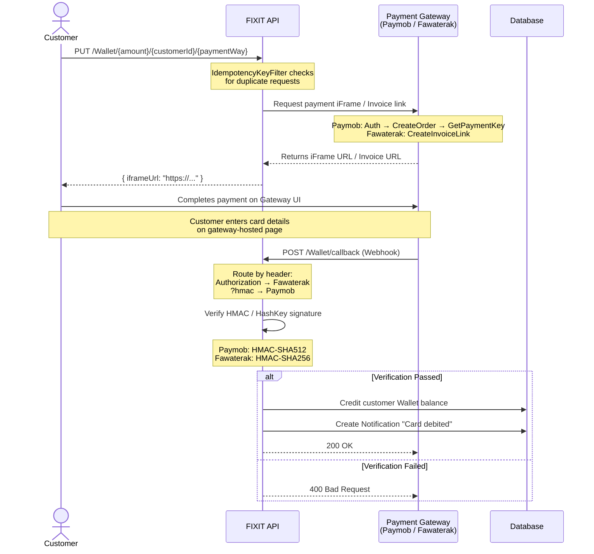
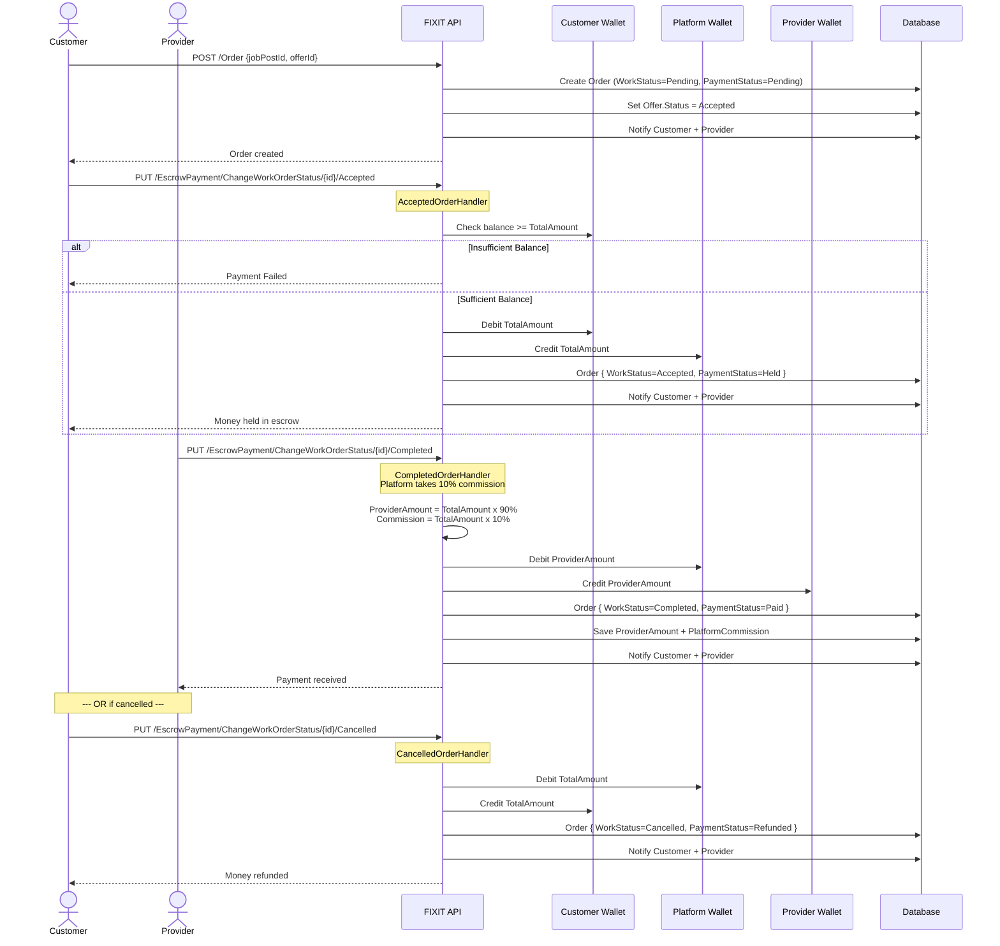
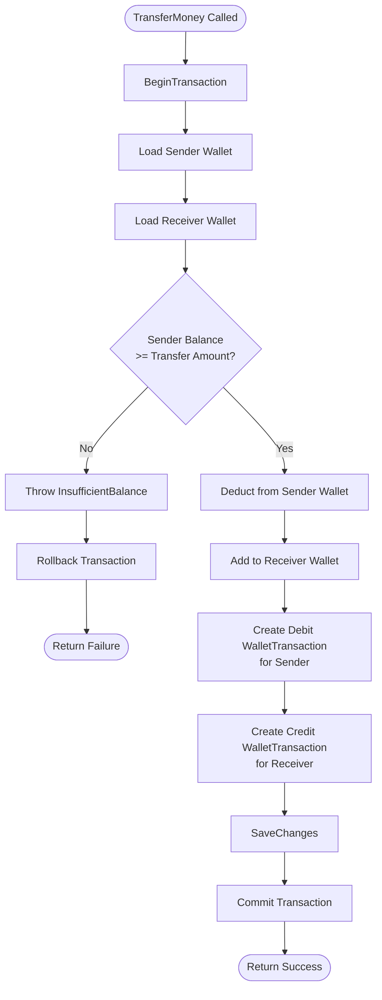
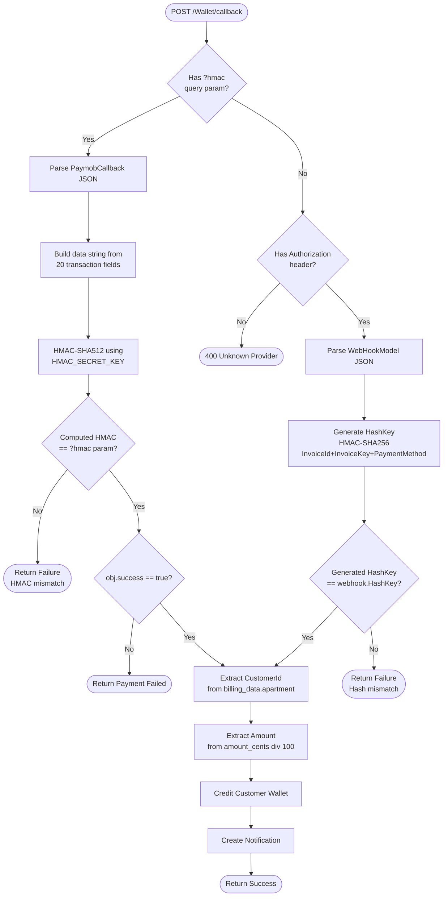
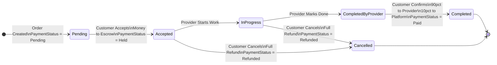

# 🔧 FIXIT — Service Marketplace Platform

<div align="center">


**FIXIT** is a full-stack service marketplace platform that connects **Customers** with verified **Service Providers** (plumbers, electricians, maintenance workers, etc.) — similar to Uber or TaskRabbit.

🌐 **Live API:** `https://fixit22.runasp.net`

</div>

---

## 📋 Table of Contents

- [Overview](#overview)
- [Architecture](#architecture)
- [Tech Stack](#tech-stack)
- [Project Structure](#project-structure)
- [Core Features](#core-features)
- [Design Patterns](#design-patterns)
- [Database Schema](#database-schema)
- [Authentication & Security](#authentication--security)
- [Payment Integrations](#payment-integrations)
- [Payment Flow Diagrams](#payment-flow-diagrams)
- [Real-Time Chat (SignalR)](#real-time-chat-signalr)
- [Caching & Filters](#caching--filters)
- [Localization (i18n)](#localization-i18n)
- [Logging (Serilog)](#logging-serilog)
- [CI/CD Pipeline](#cicd-pipeline)
- [Environment Variables](#environment-variables)
- [Getting Started](#getting-started)

---

## Overview

FIXIT allows customers to post job requests and receive offers from service providers. Once an offer is accepted, an order is created and goes through a full **escrow payment lifecycle** — ensuring money is held safely until the work is completed.

### Core Flow

```
Customer posts Job → Provider submits Offer → Customer accepts Offer
→ Order created → Customer pays to Escrow → Work done
→ Provider gets paid → Rating submitted
```

---

## Architecture

FIXIT follows **Clean Architecture** with clear separation of concerns across 4 layers:

```
FIXIT.API              → Entry point, Program.cs, DI wiring
FIXIT.Presentation     → Controllers, Filters, Hubs, Service Registration
FIXIT.Application      → Services, DTOs, Interfaces, Handlers
FIXIT.Infrastructure   → EF Core DbContext, Repositories, Migrations
FIXIT.Domain           → Entities, Value Objects, Abstractions, Helpers
```

### Dependency Direction

```
API → Presentation → Application → Domain
                ↑
          Infrastructure
```

---

## Tech Stack

| Category | Technology |
|---|---|
| **Framework** | ASP.NET Core 9.0 |
| **ORM** | Entity Framework Core 9 |
| **Database** | Microsoft SQL Server |
| **Identity** | ASP.NET Core Identity (AddIdentityCore) |
| **Auth** | JWT Bearer + Refresh Token Rotation |
| **Real-Time** | SignalR (Chat Hub) |
| **Mapping** | Mapster 7.4 |
| **Logging** | Serilog (Console + File sink) |
| **Caching** | IMemoryCache |
| **Localization** | Custom JSON-based i18n (ar-EG / en-US) |
| **Payments** | Paymob + Fawaterak |
| **Containerization** | Docker |
| **CI/CD** | GitHub Actions → GHCR |
| **Geo-Spatial** | NetTopologySuite (Point/Geography) |
| **Environment** | DotNetEnv (.env file) |

---

## Project Structure

```
FIXIT/
├── FIXIT.API/
│   ├── Program.cs
│   ├── appsettings.json
│   └── wwwroot/                  # Static files, email templates, images
│
├── FIXIT.Presentation/
│   ├── Controllers/              # AuthController, JobPostController, OfferController...
│   ├── Filters/                  # HandleCachingResourcesFilter, IdempotencyKeyFilter
│   ├── Hubs/                     # ChatHub (SignalR)
│   ├── Attributes/               # CacheableAttribute
│   └── ServiceRegistration/      # Extension methods for DI
│
├── FIXIT.Application/
│   ├── Services/                 # AuthService, WalletService, JobPostService...
│   ├── IServices/                # Service interfaces
│   ├── DTOs/                     # Data Transfer Objects
│   ├── Handlers/                 # Role handlers, Order status handlers
│   └── GlobalUsings.cs
│
├── FIXIT.Infrastructure/
│   ├── Data/
│   │   ├── Context/              # AppDbContext, AppDbContextFactory
│   │   └── Configs/              # EF Fluent API configurations + Mapster config
│   ├── Repositories/             # BaseRepository<T>
│   ├── Migrations/
│   └── UnitOfWork.cs
│
├── FIXIT.Domain/
│   ├── Entities/                 # ApplicationUser, JobPost, Offer, Order, Wallet...
│   ├── ValueObjects/             # Price, Rate, ImgPath
│   ├── Abstractions/             # Result<T>, Error, IUnitOfWork, IBaseRepository<T>
│   ├── Helpers/                  # JWT, JWTService, EgyptTimeHelper
│   ├── Factories/                # AuthModelFactory
│   └── Resources/                # ar-EG.json, en-US.json
│
├── Dockerfile
└── .github/workflows/fixit-image.yml
```

---

## Core Features

### 👤 User Management
- Register as **Customer** or **Service Provider**
- Email verification with OTP code (cached in IMemoryCache)
- Forgot password / Reset password via email
- Profile image upload (stored in `wwwroot/images`)
- Update profile info (name, phone, location, email)
- Geo-spatial location using **NetTopologySuite** (`Point` / `geography`)

### 📋 Job Posts
- Customers create job posts with description, service type, and images
- Soft delete (`IsDeleted` flag)
- Filter by: customer ID, customer name, date range, service type, status
- Images stored as `ImgPath` Value Objects

### 💼 Offers
- Providers submit offers on job posts (price + description)
- Customers can filter offers by: provider name, price range, status
- Offer statuses: `Pending`, `Accepted`, `Rejected`

### 📦 Orders
- Created when a customer accepts an offer
- Work statuses: `Pending` → `Accepted` → `InProgress` → `CompletedByProvider` → `Completed` / `Cancelled`
- Payment statuses: `Pending` → `Held` → `Paid` / `Failed` / `Refunded`

### 💰 Escrow Payment System
Orders go through a full escrow lifecycle:

```
1. Customer Accepts Order   → Money moved: Customer Wallet → Platform Wallet (Held)
2. Work Completed           → Money split:
                               - 90% → Provider Wallet
                               - 10% → Platform Commission
3. Order Cancelled          → Money refunded: Platform Wallet → Customer Wallet
```

Each transfer creates `WalletTransaction` records (Debit + Credit).

### ⭐ Provider Ratings
- Customers can rate providers (1–5, steps of 0.5)
- `Rate` Value Object validates rating range
- Average rating calculation per provider

### 🔔 Notifications
- In-app notifications triggered on: offer created, order accepted/cancelled/completed, payment events
- `UserNotification` join table links users to notifications
- Mark as read functionality

### 💬 Real-Time Chat
- SignalR-based chat between customers and providers
- Create or retrieve existing chat between 2 users
- Message history with sender info
- Soft delete chats

---

## Design Patterns

### Strategy Pattern — `IUserRoleHandler`
When a user registers, the appropriate role handler is selected at runtime:

```csharp
public interface IUserRoleHandler
{
    UserRole Role { get; }
    Task HandleAsync(ApplicationUser user);
}
// Implementations: CustomerRoleHandler, ProviderRoleHandler
```

Each handler: assigns the Identity role, creates Customer/ServiceProvider entity, and creates a Wallet.

### Strategy Pattern — `IOrderStatusHandler`
Escrow state machine uses handlers per `WorkStatus`:

```csharp
public interface IOrderStatusHandler
{
    WorkStatus Status { get; }
    Task<Result<OrderDTO>> HandleAsync(Order order);
}
// Implementations: AcceptedOrderHandler, CancelledOrderHandler, CompletedOrderHandler
```

### Strategy Pattern — `IPaymentGateway`
Both payment providers implement the same interface:

```csharp
public interface IPaymentGateway
{
    PaymentWay paymentWay { get; }
    Task<string> Pay(int amountCents, string userId);
    Task<bool> RecieveCallback(object payload, Dictionary<string, string> headers);
    Task<decimal> ExtractAmountAsync(object payload);
    Task<string> ExtractCustomerIdAsync(object payload);
}
// Implementations: PayMobService, FawaterakPaymentService
```

### Builder Pattern — `UserBuilder`
Fluent builder for constructing `ApplicationUser` objects:

```csharp
var user = new UserBuilder(new ApplicationUser { Name = "...", Location = ... })
    .SetName("Yousef")
    .SetEmail("yousef@example.com")
    .SetLocation(31.2, 30.06)
    .Build();
```

### Simple Factory — `AuthModelFactory`
Centralizes `AuthModel` creation, keeping auth logic clean.

### Unit of Work + Repository — `IUnitOfWork` / `IBaseRepository<T>`
Generic repository with projection support via Mapster's `ProjectToType<TDto>()`, combined with transaction management:

```csharp
unitOfWork.BeginTransaction();
// ... operations
unitOfWork.Commit(); // or Rollback()
```

### Result Pattern — `Result<T>`
All service methods return `Result<T>` with `IsSuccess`, `Value`, and `Error`:

```csharp
public class Result<T>
{
    public bool IsSuccess { get; }
    public T Value { get; }
    public Error Error { get; }
    public static Result<T> Success(T value) => ...;
    public static Result<T> Failure(Error error) => ...;
}
```

### Service Manager — `IServiceManager`
Lazy-loaded facade over all application services, preventing circular dependency issues:

```csharp
// Instead of injecting 10 services, inject IServiceManager
public OrderController(IServiceManager serviceManager) { ... }
```

---

## Database Schema

### Core Entities

| Entity | Description |
|---|---|
| `ApplicationUser` | Extends IdentityUser — Name, Location (Point), Img (Value Object) |
| `Customer` | 1-to-1 with ApplicationUser, has job posts |
| `ServiceProvider` | 1-to-1 with ApplicationUser, has offers and ratings |
| `JobPost` | Posted by Customer — Description, ServiceType, Status |
| `JobPostImg` | Images attached to a job post (ImgPath Value Object) |
| `Offer` | Submitted by Provider on a JobPost — Price (Value Object) |
| `Order` | Created from accepted Offer — TotalAmount, ProviderAmount, PlatformCommission |
| `Wallet` | One per user — Balance (Price Value Object) |
| `WalletTransaction` | Debit/Credit records linked to Orders and Wallets |
| `ProviderRates` | Customer rates Provider — Rate (Value Object 1-5 step 0.5) |
| `Notification` | System notifications |
| `UserNotification` | Join table (UserId + NotifId) with IsRead flag |
| `Chat` | Conversation between 2 users |
| `ChatParticipant` | Links users to chats |
| `ChatMessage` | Messages within a chat |
| `RefreshToken` | Owned entity on ApplicationUser |

### Value Objects

| Value Object | Validation |
|---|---|
| `Price` | amount ≥ 0, rounded to 2 decimals, currency default "EGP" |
| `Rate` | 1.0 to 5.0 in 0.5 steps |
| `ImgPath` | non-empty, valid extension (.jpg, .jpeg, .png, .webp) |

---

## Authentication & Security

### JWT Authentication
- `AddIdentityCore` (not `AddIdentity`) — avoids cookie scheme overriding JWT
- Short-lived JWT access token (configured via `DurationInSeconds` in appsettings)
- JWT claims: `sub` (username), `email`, `uid` (userId), `roles`
- `IssuerSigningKey` loaded from environment variable `JWTKey`

### Refresh Token Rotation
- Refresh tokens stored as owned collection on `ApplicationUser`
- Stored in **HttpOnly Secure SameSite=None cookies**
- On refresh: old token revoked (`RevokedOn` set), new token generated
- Token validity: `IsActive = RevokedOn == null && !IsExpired`

### Idempotency Filter
Prevents duplicate requests using `Idempotency-Key` header stored in IMemoryCache (1-hour window):

```csharp
[ServiceFilter(typeof(IdempotencyKeyFilter))]
[HttpPut("ChargeWallet/{amount}/{CustomerId}/{paymentWay}")]
public async Task<IActionResult> ChargeWallet(...)
```

---

## Payment Integrations

### Paymob
Flow: Authenticate → Create Order → Get Payment Key → Return iFrame URL

HMAC verification using `HMAC_SECRET_KEY` on webhook callback.

### Fawaterak
Creates invoice link via staging API: `https://staging.fawaterk.com/api/v2/createInvoiceLink`

HashKey verification: `HMAC-SHA256(InvoiceId + InvoiceKey + PaymentMethod, ApiKey)`

### Webhook Routing (`/Wallet/callback`)
```csharp
if (Request.Headers.ContainsKey("Authorization"))  // → Fawaterak
else if (Request.Query.ContainsKey("hmac"))         // → Paymob
```

On successful callback → credit customer wallet → create notification.

---

## Payment Flow Diagrams

### 1️⃣ Wallet Charging Flow (Paymob / Fawaterak)

How a customer tops up their wallet balance using an external payment gateway.



---

### 2️⃣ Escrow Payment Flow (Order Lifecycle)

The full money lifecycle from order creation to provider payment.



---

### 3️⃣ Wallet Transfer Internal Logic

How `TransferMoney` works inside `WalletService`:



---

### 4️⃣ Paymob Webhook Verification

How FIXIT verifies Paymob callbacks to prevent fraud:



---

### 5️⃣ Escrow State Machine



---


## Real-Time Chat (SignalR)

Hub: `/chatHub`

```javascript
// Client connects and joins a chat room
const connection = new signalR.HubConnectionBuilder()
    .withUrl("https://api-url/chatHub")
    .build();

await connection.invoke("JoinChat", chatId.toString());
await connection.invoke("SendMsg", messageDto);

connection.on("ReceiveMessage", (message) => { /* render */ });
```

Server-side `ChatHub` saves the message via `ChatService` and broadcasts to all clients in the room.

---

## Caching & Filters

### `HandleCachingResourcesFilter`
Global `IResourceFilter` that caches `GET` responses for endpoints marked with `[Cacheable]`:

```csharp
[Cacheable("Offers.ByJobPostId")]
[HttpGet("ByJobPostId/{id}")]
public async Task<IActionResult> GetOffersByJobPostId(int id) { ... }
```

Cache key includes both the attribute key **and** the full request path+query to avoid collisions:

```csharp
private string GetCacheKey(HttpContext ctx, CacheableAttribute attr)
    => $"{attr.Key}:{ctx.Request.Path}{ctx.Request.QueryString}";
```

Cache TTL: 10 minutes.

---

## Localization (i18n)

Custom JSON-based localizer supporting **Arabic (ar-EG)** and **English (en-US)**:

```
FIXIT.Domain/Resources/
├── ar-EG.json
└── en-US.json
```

Switch language via:
- Query string: `?culture=ar-EG`
- Cookie
- `Accept-Language` header

Usage in services:
```csharp
return Result<T>.Failure(new Error("Wallet.NotFound", _localizer["Wallet.NotFound"]));
```

With format args:
```csharp
_localizer["Wallet.ChargedSuccess", amount]  // → "تم شحن المحفظة بنجاح بمبلغ 500 جنيه."
```

---

## Logging (Serilog)

Configured with dual sinks — Console and rolling file:

```json
"WriteTo": [
  { "Name": "Console" },
  {
    "Name": "File",
    "Args": {
      "path": "logs/logs-.json",
      "rollingInterval": "Day",
      "retainedFileCountLimit": 7
    }
  }
]
```

Relative path used for cross-platform compatibility (deployed on Linux/Docker).

Enriched with: `FromLogContext`, `WithMachineName`, `WithProcessId`, `WithThreadId`.

---

## CI/CD Pipeline

GitHub Actions workflow (`.github/workflows/fixit-image.yml`):

```
Push to main
    ↓
Build Docker image
    ↓
Push to GitHub Container Registry (ghcr.io)
    ↓
Tagged: latest + commit SHA
```

All secrets injected at build time as Docker `ARG` → `ENV`.

### Docker Image

Multi-stage build:
1. **Stage 1 (build):** `dotnet/sdk:9.0` — restore, publish Release
2. **Stage 2 (runtime):** `dotnet/aspnet:9.0` — lean runtime image

```bash
# Pull and run
docker pull ghcr.io/<owner>/fixit:latest
docker run -p 8080:8080 --env-file .env ghcr.io/<owner>/fixit:latest
```

---

## Environment Variables

| Variable | Description |
|---|---|
| `constr` | SQL Server connection string |
| `JWTKey` | JWT signing secret key |
| `EmailPassword` | SMTP password for Gmail |
| `PAYMOP_API_KEY` | Paymob API key |
| `PAYMOP_INTEGRATION_ID` | Paymob integration ID |
| `PAYMOP_IFRAME_ID` | Paymob iFrame ID |
| `HMAC_SECRET_KEY` | Paymob HMAC secret for webhook verification |
| `Fawaterek_API_KEY` | Fawaterak API key |
| `PROVIDER_KEY` | Fawaterak provider key |
| `CLIENTGOOGLEID` | Google OAuth client ID |
| `CLIENTGOOGLESECRET` | Google OAuth client secret |

Create a `.env` file in the project root — loaded automatically via `DotNetEnv`.

---

## Getting Started

### Prerequisites

- .NET 9.0 SDK
- SQL Server
- (Optional) Docker

### Local Setup

```bash
# 1. Clone the repository
git clone https://github.com/<owner>/fixit.git
cd fixit

# 2. Create .env file with required variables
cp .env.example .env
# Edit .env with your values

# 3. Apply database migrations
cd FIXIT.Infrastructure
dotnet ef database update --startup-project ../FIXIT.API

# 4. Run the API
cd ../FIXIT.API
dotnet run
```

API will be available at: `https://localhost:7195` / `http://localhost:5074`

### Docker Setup

```bash
# Build image
docker build -t fixit .

# Run with environment variables
docker run -p 8080:8080 --env-file .env fixit
```

### Key API Endpoints

| Method | Route | Description |
|---|---|---|
| POST | `/Auth/Register` | Register new user (Customer or Provider) |
| POST | `/Auth/LogIn` | Login, returns JWT + sets refresh token cookie |
| POST | `/Auth/RefreshToken` | Rotate refresh token |
| POST | `/Auth/VerifyCode/{code}` | Verify email OTP → create user |
| GET | `/JobPost/ByServiceType/{type}` | Get posts by service type |
| POST | `/JobPost` | Create new job post (Customer) |
| POST | `/Offer` | Submit offer on a job post (Provider) |
| POST | `/Order` | Create order from accepted offer (Customer) |
| PUT | `/EscrowPayment/ChangeWorkOrderStatus/{orderId}/{status}` | Update order status |
| PUT | `/Wallet/{amount}/{customerId}/{paymentWay}` | Charge wallet |
| POST | `/Wallet/callback` | Payment webhook (Paymob / Fawaterak) |
| POST | `/Chat/GetOrCreateChat` | Start or retrieve chat session |
| GET | `/Notification/{userId}` | Get user notifications |
| POST | `/ProviderRating/AddProviderRating` | Submit provider rating |

---

## 📌 Key Technical Decisions

| Decision | Reason |
|---|---|
| `AddIdentityCore` instead of `AddIdentity` | `AddIdentity` silently registers cookie auth as the default scheme, overriding JWT in API-only projects |
| `Owned` Value Objects for Price, Rate, ImgPath | Enforce business invariants at the type level; validated on creation |
| Relative log paths | Avoid hardcoded Windows paths that break on Linux/Docker deployment |
| Cache key includes path + query | Prevent cross-request cache collisions when same route attribute is used for different parameters |
| Refresh token in HttpOnly cookie | Protects against XSS while keeping auth flow stateless |
| `EgyptTimeHelper` static class | Centralizes Egypt Standard Time conversions; DB stores UTC, display uses Cairo time |

---

<div align="center">

Built with ❤️ using ASP.NET Core 9 · Entity Framework Core · SignalR · Mapster · Serilog

</div>
