# FIXIT System Documentation

## System Overview
FIXIT is a home services marketplace API where **Customers** post job requests and **Service Providers** submit offers. The system handles the full lifecycle: registration → job posting → bidding → order creation → escrow payment → work completion → provider payout.

---

## Actors

| Actor | Role |
|---|---|
| **Customer** | Posts jobs, accepts offers, creates orders, charges wallet, rates providers |
| **Service Provider** | Submits/manages offers, updates work status |
| **Platform** | Holds escrow (WalletId=1), takes 10% commission |
| **System** | Sends notifications, handles payment callbacks, manages tokens |

---

## Modules

1. Authentication & Registration
2. Job Post Management
3. Offer Management
4. Order Management
5. Escrow Payment
6. Wallet & Payment Gateway
7. Notifications
8. Chat
9. Provider Rating

---

## Flow 1: Authentication & Registration

### Description
Two-step registration with email verification. JWT + Refresh Token auth. Role-based (Customer/Provider) with separate entity creation and wallet initialization.

### Sequence Diagram — Register
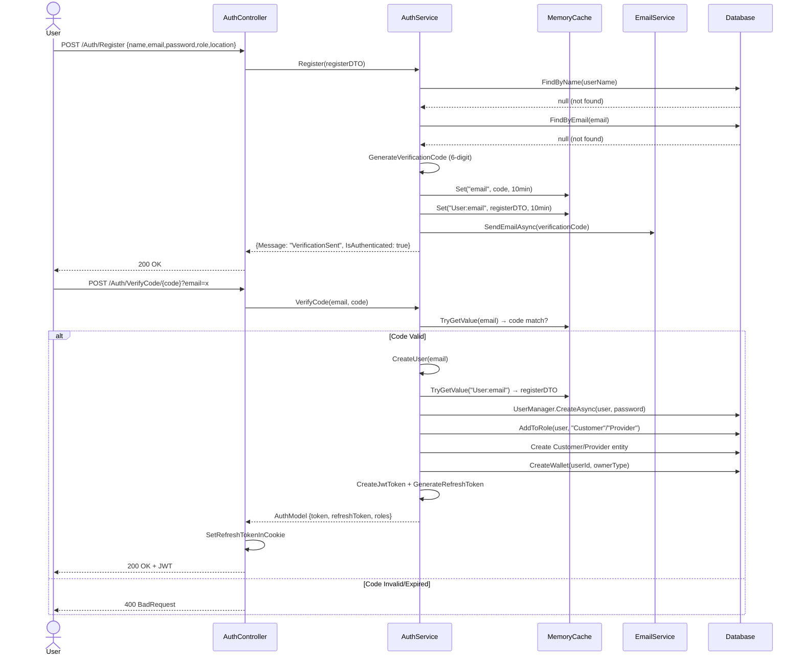
```mermaid
sequenceDiagram
    actor User
    participant API as AuthController
    participant Auth as AuthService
    participant Cache as MemoryCache
    participant Email as EmailService
    participant DB as Database

    User->>API: POST /Auth/Register {name,email,password,role,location}
    API->>Auth: Register(registerDTO)
    Auth->>DB: FindByName(userName)
    DB-->>Auth: null (not found)
    Auth->>DB: FindByEmail(email)
    DB-->>Auth: null (not found)
    Auth->>Auth: GenerateVerificationCode (6-digit)
    Auth->>Cache: Set("email", code, 10min)
    Auth->>Cache: Set("User:email", registerDTO, 10min)
    Auth->>Email: SendEmailAsync(verificationCode)
    Auth-->>API: {Message: "VerificationSent", IsAuthenticated: true}
    API-->>User: 200 OK

    User->>API: POST /Auth/VerifyCode/{code}?email=x
    API->>Auth: VerifyCode(email, code)
    Auth->>Cache: TryGetValue(email) → code match?
    alt Code Valid
        Auth->>Auth: CreateUser(email)
        Auth->>Cache: TryGetValue("User:email") → registerDTO
        Auth->>DB: UserManager.CreateAsync(user, password)
        Auth->>DB: AddToRole(user, "Customer"/"Provider")
        Auth->>DB: Create Customer/Provider entity
        Auth->>DB: CreateWallet(userId, ownerType)
        Auth->>Auth: CreateJwtToken + GenerateRefreshToken
        Auth-->>API: AuthModel {token, refreshToken, roles}
        API->>API: SetRefreshTokenInCookie
        API-->>User: 200 OK + JWT
    else Code Invalid/Expired
        API-->>User: 400 BadRequest
    end
```

### Sequence Diagram — Login
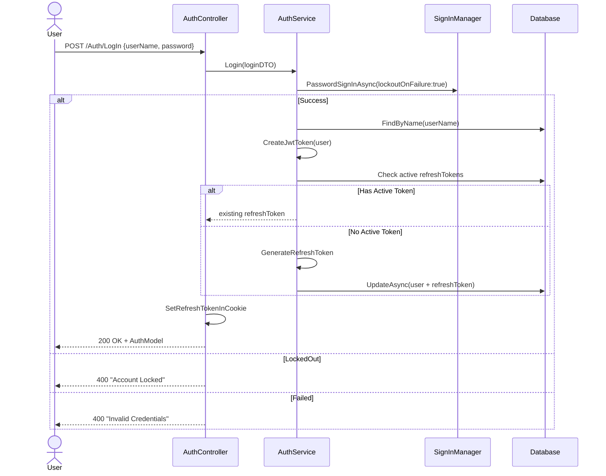
```mermaid
sequenceDiagram
    actor User
    participant API as AuthController
    participant Auth as AuthService
    participant SignIn as SignInManager
    participant DB as Database

    User->>API: POST /Auth/LogIn {userName, password}
    API->>Auth: Login(loginDTO)
    Auth->>SignIn: PasswordSignInAsync(lockoutOnFailure:true)
    alt Success
        Auth->>DB: FindByName(userName)
        Auth->>Auth: CreateJwtToken(user)
        Auth->>DB: Check active refreshTokens
        alt Has Active Token
            Auth-->>API: existing refreshToken
        else No Active Token
            Auth->>Auth: GenerateRefreshToken
            Auth->>DB: UpdateAsync(user + refreshToken)
        end
        API->>API: SetRefreshTokenInCookie
        API-->>User: 200 OK + AuthModel
    else LockedOut
        API-->>User: 400 "Account Locked"
    else Failed
        API-->>User: 400 "Invalid Credentials"
    end
```

### Activity Diagram — Token Refresh
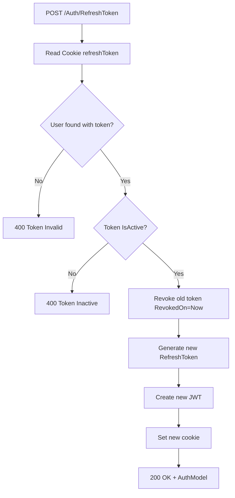
```mermaid
flowchart TD
    A[POST /Auth/RefreshToken] --> B[Read Cookie refreshToken]
    B --> C{User found with token?}
    C -- No --> D[400 Token Invalid]
    C -- Yes --> E{Token IsActive?}
    E -- No --> F[400 Token Inactive]
    E -- Yes --> G[Revoke old token RevokedOn=Now]
    G --> H[Generate new RefreshToken]
    H --> I[Create new JWT]
    I --> J[Set new cookie]
    J --> K[200 OK + AuthModel]
```

### Business Rules
- Password: min 8 chars, upper + lower + digit, no special chars
- Username: min 10 chars, alphanumeric only
- Verification code expires in **10 minutes**
- Account locks out after repeated failed logins
- Refresh token valid for **10 days**
- JWT ClockSkew = Zero (strict expiry)

---

## Flow 2: Job Post Management

### Description
Customers create job posts with optional images. Posts can be filtered by customer, name, service type, date range, or status. Soft-delete pattern used.

### Sequence Diagram — Create Job Post
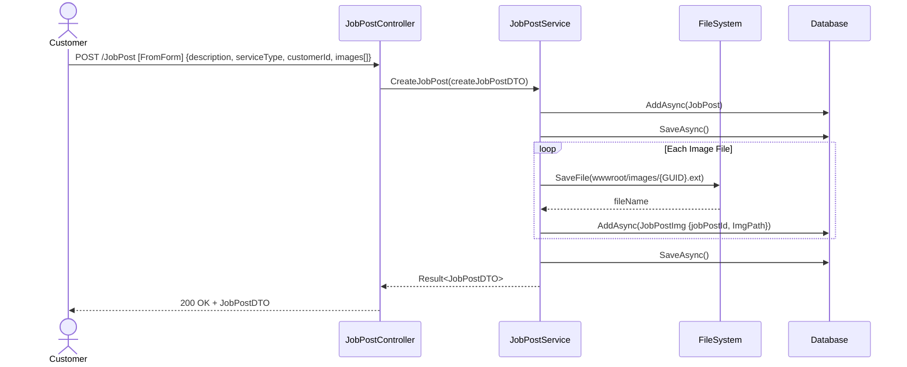
```mermaid
sequenceDiagram
    actor Customer
    participant API as JobPostController
    participant Svc as JobPostService
    participant FS as FileSystem
    participant DB as Database

    Customer->>API: POST /JobPost [FromForm] {description, serviceType, customerId, images[]}
    API->>Svc: CreateJobPost(createJobPostDTO)
    Svc->>DB: AddAsync(JobPost)
    Svc->>DB: SaveAsync()
    loop Each Image File
        Svc->>FS: SaveFile(wwwroot/images/{GUID}.ext)
        FS-->>Svc: fileName
        Svc->>DB: AddAsync(JobPostImg {jobPostId, ImgPath})
    end
    Svc->>DB: SaveAsync()
    Svc-->>API: Result<JobPostDTO>
    API-->>Customer: 200 OK + JobPostDTO
```

### Activity Diagram — Query Job Posts
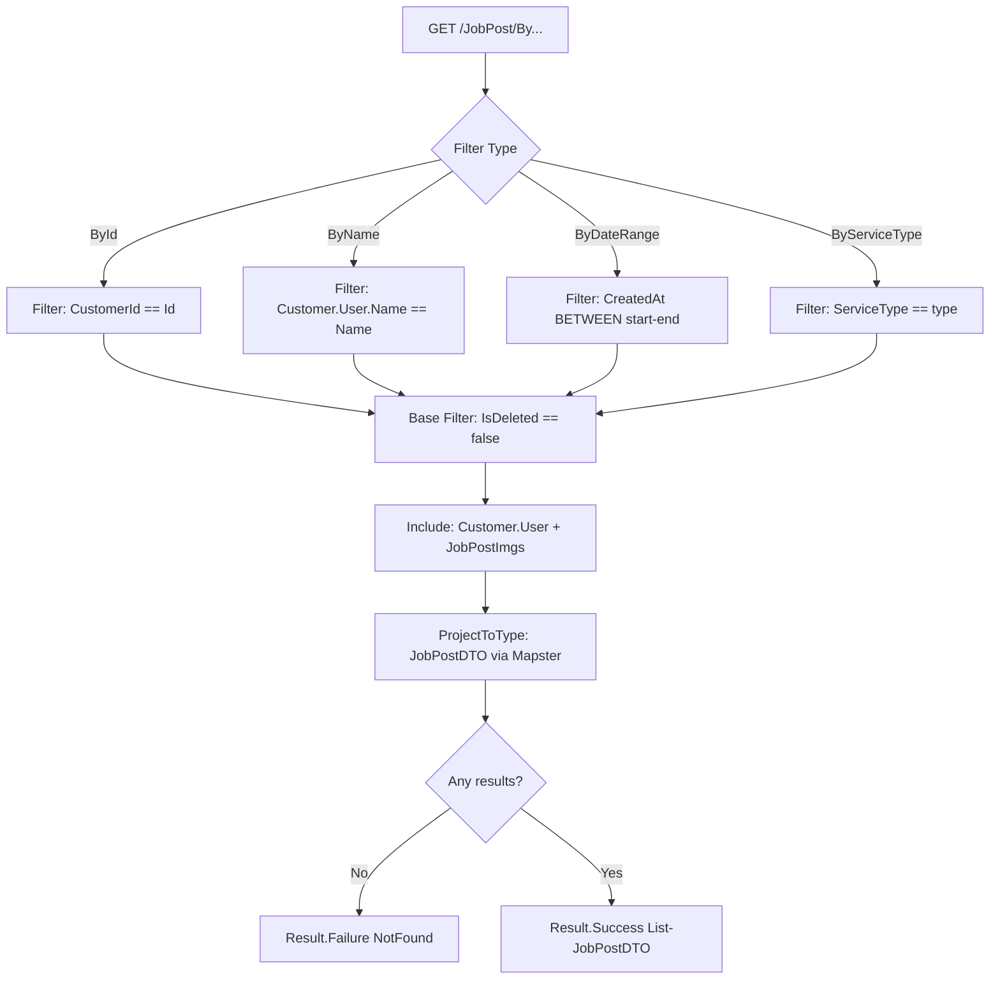
```mermaid
flowchart TD
    A[GET /JobPost/By...] --> B{Filter Type}
    B -- ById --> C[Filter: CustomerId == Id]
    B -- ByName --> D[Filter: Customer.User.Name == Name]
    B -- ByDateRange --> E[Filter: CreatedAt BETWEEN start-end]
    B -- ByServiceType --> F[Filter: ServiceType == type]
    C & D & E & F --> G[Base Filter: IsDeleted == false]
    G --> H[Include: Customer.User + JobPostImgs]
    H --> I[ProjectToType: JobPostDTO via Mapster]
    I --> J{Any results?}
    J -- No --> K[Result.Failure NotFound]
    J -- Yes --> L[Result.Success List-JobPostDTO]
```

### Business Rules
- Only **Customers** can create, update, delete posts
- Images validated: `.jpg`, `.jpeg`, `.png`, `.webp` only
- Description max **1000 chars**, ServiceType max **100 chars**
- Soft delete: `IsDeleted = true` (not physical delete)
- GET endpoints are **cached** via `CacheableAttribute` (10 min, path+query key)

---

## Flow 3: Offer Management

### Description
Service Providers submit price offers on open job posts. Customers can filter offers by various criteria. When an order is created, the selected offer status changes to `Accepted`.

### Sequence Diagram — Create Offer
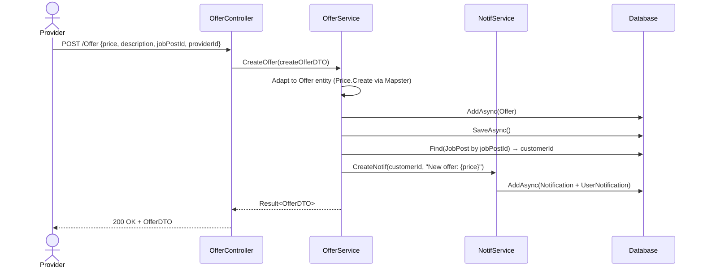
```mermaid
sequenceDiagram
    actor Provider
    participant API as OfferController
    participant Svc as OfferService
    participant Notif as NotifService
    participant DB as Database

    Provider->>API: POST /Offer {price, description, jobPostId, providerId}
    API->>Svc: CreateOffer(createOfferDTO)
    Svc->>Svc: Adapt to Offer entity (Price.Create via Mapster)
    Svc->>DB: AddAsync(Offer)
    Svc->>DB: SaveAsync()
    Svc->>DB: Find(JobPost by jobPostId) → customerId
    Svc->>Notif: CreateNotif(customerId, "New offer: {price}")
    Notif->>DB: AddAsync(Notification + UserNotification)
    Svc-->>API: Result<OfferDTO>
    API-->>Provider: 200 OK + OfferDTO
```

### Activity Diagram — Offer Lifecycle
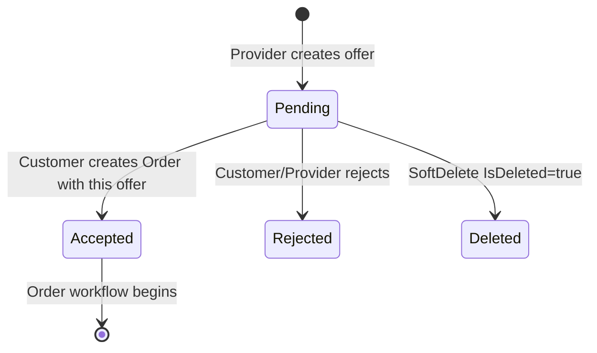
```mermaid
stateDiagram-v2
    [*] --> Pending: Provider creates offer
    Pending --> Accepted: Customer creates Order with this offer
    Pending --> Rejected: Customer/Provider rejects
    Pending --> Deleted: SoftDelete IsDeleted=true
    Accepted --> [*]: Order workflow begins
```

### Business Rules
- Only **Providers** can create/update/delete offers
- Offer price stored as `Price` value object (EGP, rounded to 2 decimals)
- Customer notified on offer create/update/delete
- Soft delete used
- `OfferStatus.Accepted` is set automatically when an Order is created

---

## Flow 4: Order Management

### Description
Customer accepts an offer by creating an Order. The Order's `TotalAmount` equals the Offer's price. Order has two status axes: `WorkStatus` and `PaymentStatus`.

### Sequence Diagram — Create Order
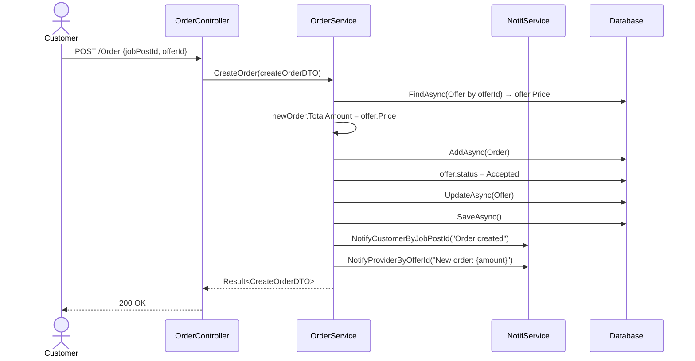
```mermaid
sequenceDiagram
    actor Customer
    participant API as OrderController
    participant Svc as OrderService
    participant Notif as NotifService
    participant DB as Database

    Customer->>API: POST /Order {jobPostId, offerId}
    API->>Svc: CreateOrder(createOrderDTO)
    Svc->>DB: FindAsync(Offer by offerId) → offer.Price
    Svc->>Svc: newOrder.TotalAmount = offer.Price
    Svc->>DB: AddAsync(Order)
    Svc->>DB: offer.status = Accepted
    Svc->>DB: UpdateAsync(Offer)
    Svc->>DB: SaveAsync()
    Svc->>Notif: NotifyCustomerByJobPostId("Order created")
    Svc->>Notif: NotifyProviderByOfferId("New order: {amount}")
    Svc-->>API: Result<CreateOrderDTO>
    API-->>Customer: 200 OK
```

### Business Rules
- Only **Customers** can create and delete orders
- `TotalAmount` = offer's accepted price (immutable after creation)
- Default: `WorkStatus = Pending`, `PaymentStatus = Pending`
- Soft delete: `IsDeleted = true`

---

## Flow 5: Escrow Payment (Order Status Transitions)

### Description
The escrow system manages money flow using a Strategy/Handler pattern. Each `WorkStatus` transition triggers a handler. Platform wallet (Id=1) acts as escrow.

### State Machine — WorkStatus
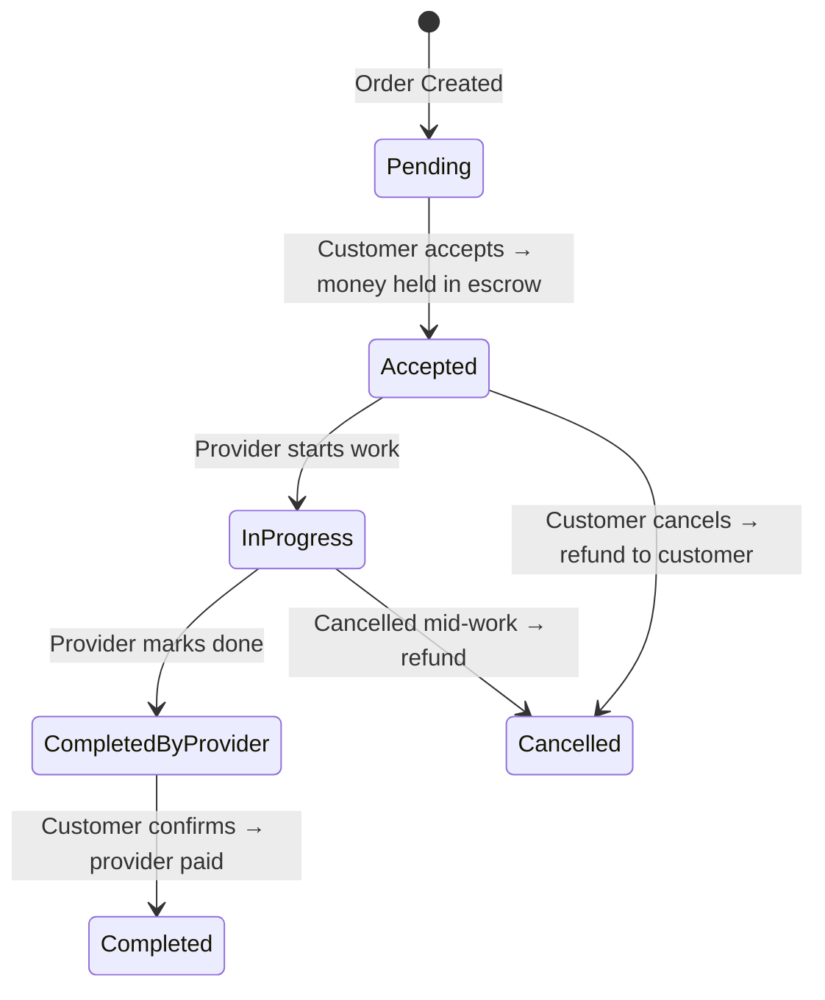
```mermaid
stateDiagram-v2
    [*] --> Pending: Order Created
    Pending --> Accepted: Customer accepts → money held in escrow
    Accepted --> InProgress: Provider starts work
    InProgress --> CompletedByProvider: Provider marks done
    CompletedByProvider --> Completed: Customer confirms → provider paid
    Accepted --> Cancelled: Customer cancels → refund to customer
    InProgress --> Cancelled: Cancelled mid-work → refund
```

### Sequence Diagram — Accept Order (Money to Escrow)
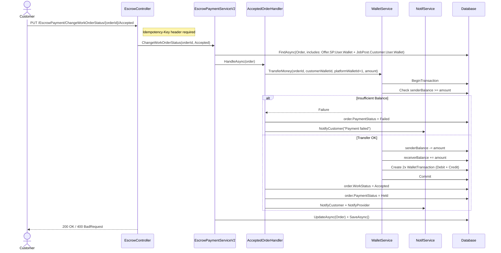
```mermaid
sequenceDiagram
    actor Customer
    participant API as EscrowController
    participant Svc as EscrowPaymentServiceV2
    participant Handler as AcceptedOrderHandler
    participant Wallet as WalletService
    participant Notif as NotifService
    participant DB as Database

    Customer->>API: PUT /EscrowPayment/ChangeWorkOrderStatus/{orderId}/Accepted
    Note right of API: Idempotency-Key header required
    API->>Svc: ChangeWorkOrderStatus(orderId, Accepted)
    Svc->>DB: FindAsync(Order, includes: Offer.SP.User.Wallet + JobPost.Customer.User.Wallet)
    Svc->>Handler: HandleAsync(order)
    Handler->>Wallet: TransferMoney(orderId, customerWalletId, platformWalletId=1, amount)
    Wallet->>DB: BeginTransaction
    Wallet->>DB: Check senderBalance >= amount
    alt Insufficient Balance
        Wallet-->>Handler: Failure
        Handler->>DB: order.PaymentStatus = Failed
        Handler->>Notif: NotifyCustomer("Payment failed")
    else Transfer OK
        Wallet->>DB: senderBalance -= amount
        Wallet->>DB: receiverBalance += amount
        Wallet->>DB: Create 2x WalletTransaction (Debit + Credit)
        Wallet->>DB: Commit
        Handler->>DB: order.WorkStatus = Accepted
        Handler->>DB: order.PaymentStatus = Held
        Handler->>Notif: NotifyCustomer + NotifyProvider
    end
    Svc->>DB: UpdateAsync(Order) + SaveAsync()
    API-->>Customer: 200 OK / 400 BadRequest
```

### Sequence Diagram — Complete Order (Payout to Provider)
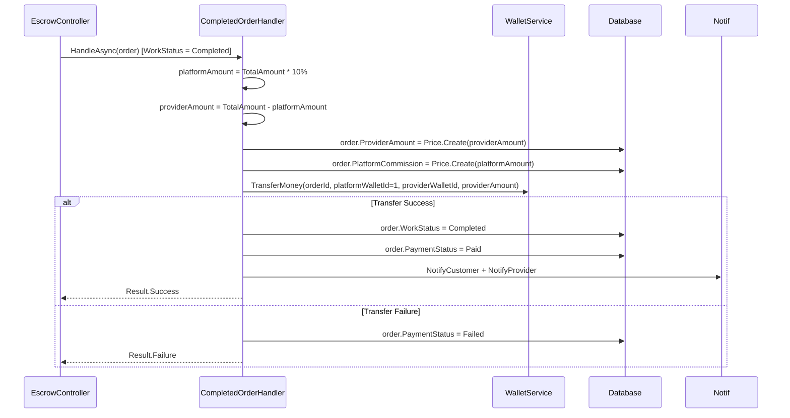
```mermaid
sequenceDiagram
    participant API as EscrowController
    participant Handler as CompletedOrderHandler
    participant Wallet as WalletService
    participant DB as Database

    API->>Handler: HandleAsync(order) [WorkStatus = Completed]
    Handler->>Handler: platformAmount = TotalAmount * 10%
    Handler->>Handler: providerAmount = TotalAmount - platformAmount
    Handler->>DB: order.ProviderAmount = Price.Create(providerAmount)
    Handler->>DB: order.PlatformCommission = Price.Create(platformAmount)
    Handler->>Wallet: TransferMoney(orderId, platformWalletId=1, providerWalletId, providerAmount)
    alt Transfer Success
        Handler->>DB: order.WorkStatus = Completed
        Handler->>DB: order.PaymentStatus = Paid
        Handler->>Notif: NotifyCustomer + NotifyProvider
        Handler-->>API: Result.Success
    else Transfer Failure
        Handler->>DB: order.PaymentStatus = Failed
        Handler-->>API: Result.Failure
    end
```

### Sequence Diagram — Cancel Order (Refund to Customer)
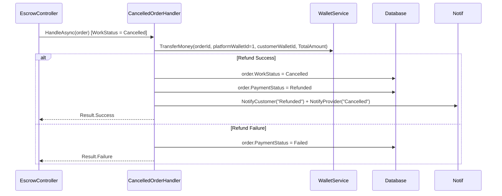
```mermaid
sequenceDiagram
    participant API as EscrowController
    participant Handler as CancelledOrderHandler
    participant Wallet as WalletService
    participant DB as Database

    API->>Handler: HandleAsync(order) [WorkStatus = Cancelled]
    Handler->>Wallet: TransferMoney(orderId, platformWalletId=1, customerWalletId, TotalAmount)
    alt Refund Success
        Handler->>DB: order.WorkStatus = Cancelled
        Handler->>DB: order.PaymentStatus = Refunded
        Handler->>Notif: NotifyCustomer("Refunded") + NotifyProvider("Cancelled")
        Handler-->>API: Result.Success
    else Refund Failure
        Handler->>DB: order.PaymentStatus = Failed
        Handler-->>API: Result.Failure
    end
```

### Activity Diagram — Handler Routing
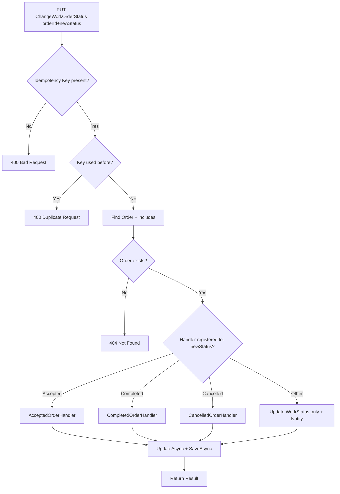
```mermaid
flowchart TD
    A[PUT ChangeWorkOrderStatus orderId+newStatus] --> B{Idempotency Key present?}
    B -- No --> C[400 Bad Request]
    B -- Yes --> D{Key used before?}
    D -- Yes --> E[400 Duplicate Request]
    D -- No --> F[Find Order + includes]
    F --> G{Order exists?}
    G -- No --> H[404 Not Found]
    G -- Yes --> I{Handler registered for newStatus?}
    I -- Accepted --> J[AcceptedOrderHandler]
    I -- Completed --> K[CompletedOrderHandler]
    I -- Cancelled --> L[CancelledOrderHandler]
    I -- Other --> M[Update WorkStatus only + Notify]
    J & K & L & M --> N[UpdateAsync + SaveAsync]
    N --> O[Return Result]
```

### Business Rules
- **Idempotency-Key** header is mandatory for all escrow operations
- Platform takes exactly **10% commission** on completion
- Provider receives **90%** of `TotalAmount`
- Money flows: `Customer → Escrow(Platform)` on Accept; `Escrow → Provider` on Complete; `Escrow → Customer` on Cancel
- All wallet transfers are **transactional** (BeginTransaction / Commit / Rollback)
- Each transfer creates **2 WalletTransaction** records (Debit sender + Credit receiver)

---

## Flow 6: Wallet & Payment Gateway

### Description
Customers top up wallets via external payment gateways (Paymob or Fawaterak). System verifies webhook callbacks via HMAC and credits the wallet.

### Sequence Diagram — Charge Wallet
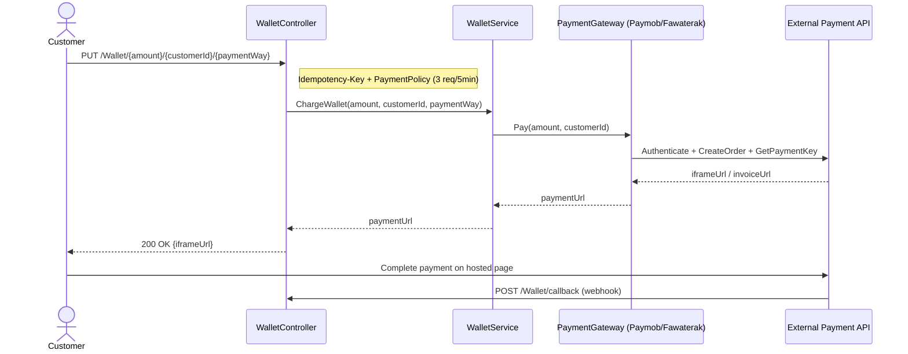
```mermaid
sequenceDiagram
    actor Customer
    participant API as WalletController
    participant Wallet as WalletService
    participant Gateway as PaymentGateway (Paymob/Fawaterak)
    participant ExtAPI as External Payment API

    Customer->>API: PUT /Wallet/{amount}/{customerId}/{paymentWay}
    Note right of API: Idempotency-Key + PaymentPolicy (3 req/5min)
    API->>Wallet: ChargeWallet(amount, customerId, paymentWay)
    Wallet->>Gateway: Pay(amount, customerId)
    Gateway->>ExtAPI: Authenticate + CreateOrder + GetPaymentKey
    ExtAPI-->>Gateway: iframeUrl / invoiceUrl
    Gateway-->>Wallet: paymentUrl
    Wallet-->>API: paymentUrl
    API-->>Customer: 200 OK {iframeUrl}
    Customer->>ExtAPI: Complete payment on hosted page
    ExtAPI->>API: POST /Wallet/callback (webhook)
```

### Sequence Diagram — Webhook Callback
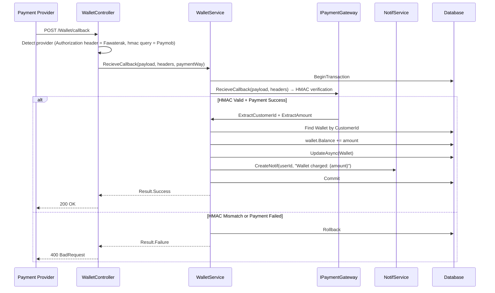
```mermaid
sequenceDiagram
    participant ExtAPI as Payment Provider
    participant API as WalletController
    participant Wallet as WalletService
    participant Gateway as IPaymentGateway
    participant Notif as NotifService
    participant DB as Database

    ExtAPI->>API: POST /Wallet/callback
    API->>API: Detect provider (Authorization header = Fawaterak, hmac query = Paymob)
    API->>Wallet: RecieveCallback(payload, headers, paymentWay)
    Wallet->>DB: BeginTransaction
    Wallet->>Gateway: RecieveCallback(payload, headers) → HMAC verification
    alt HMAC Valid + Payment Success
        Gateway->>Wallet: ExtractCustomerId + ExtractAmount
        Wallet->>DB: Find Wallet by CustomerId
        Wallet->>DB: wallet.Balance += amount
        Wallet->>DB: UpdateAsync(Wallet)
        Wallet->>Notif: CreateNotif(userId, "Wallet charged: {amount}")
        Wallet->>DB: Commit
        Wallet-->>API: Result.Success
        API-->>ExtAPI: 200 OK
    else HMAC Mismatch or Payment Failed
        Wallet->>DB: Rollback
        Wallet-->>API: Result.Failure
        API-->>ExtAPI: 400 BadRequest
    end
```

### Activity Diagram — Withdraw
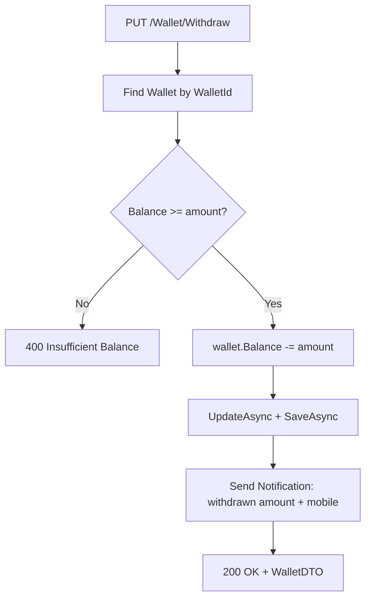
```mermaid
flowchart TD
    A[PUT /Wallet/Withdraw] --> B[Find Wallet by WalletId]
    B --> C{Balance >= amount?}
    C -- No --> D[400 Insufficient Balance]
    C -- Yes --> E[wallet.Balance -= amount]
    E --> F[UpdateAsync + SaveAsync]
    F --> G[Send Notification: withdrawn amount + mobile]
    G --> H[200 OK + WalletDTO]
```

### Business Rules
- Two payment providers: **Paymob** (HMAC-SHA512) and **Fawaterak** (HMAC-SHA256)
- Webhook endpoint is `AllowAnonymous` + `DisableRateLimiting`
- Wallet charge rate-limited: **3 requests per 5 minutes** per user
- Withdrawal requires sufficient balance (no overdraft)
- All balance mutations are atomic (transaction-wrapped)

---

## Flow 7: Notification System

### Description
Notifications are event-driven, created automatically by services. Users can retrieve and mark them as read.

### Sequence Diagram — Notify on Event
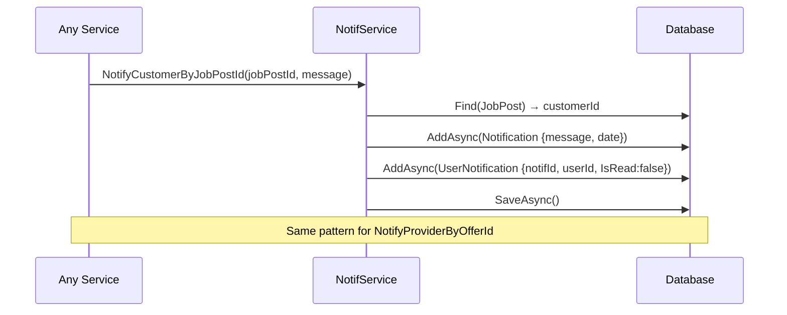
```mermaid
sequenceDiagram
    participant Service as Any Service
    participant Notif as NotifService
    participant DB as Database

    Service->>Notif: NotifyCustomerByJobPostId(jobPostId, message)
    Notif->>DB: Find(JobPost) → customerId
    Notif->>DB: AddAsync(Notification {message, date})
    Notif->>DB: AddAsync(UserNotification {notifId, userId, IsRead:false})
    Notif->>DB: SaveAsync()

    Note over Service,DB: Same pattern for NotifyProviderByOfferId
```

### Activity Diagram — Notification Read Flow
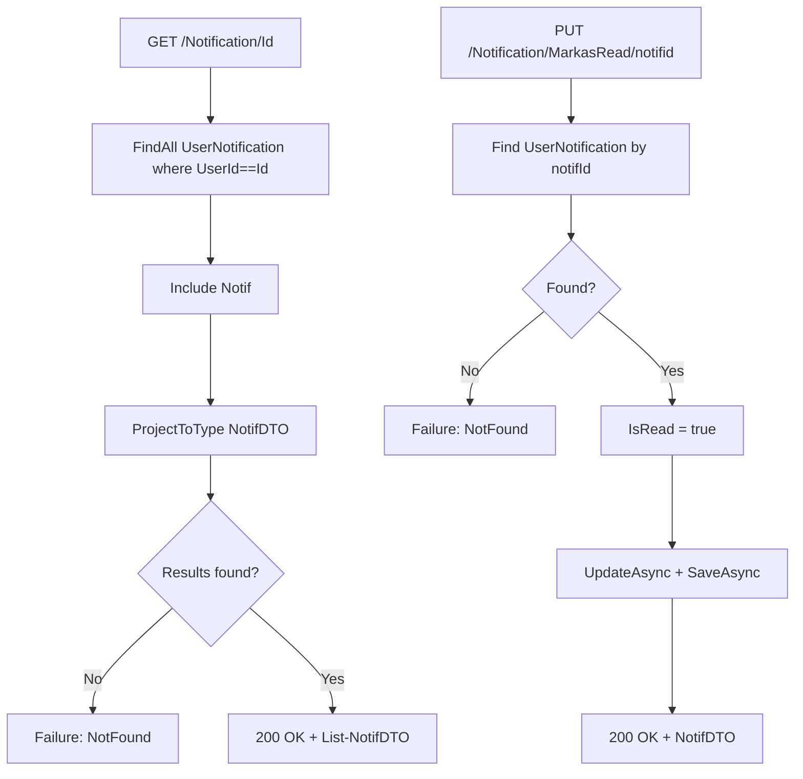
```mermaid
flowchart TD
    A[GET /Notification/Id] --> B[FindAll UserNotification where UserId==Id]
    B --> C[Include Notif]
    C --> D[ProjectToType NotifDTO]
    D --> E{Results found?}
    E -- No --> F[Failure: NotFound]
    E -- Yes --> G[200 OK + List-NotifDTO]

    H[PUT /Notification/MarkasRead/notifid] --> I[Find UserNotification by notifId]
    I --> J{Found?}
    J -- No --> K[Failure: NotFound]
    J -- Yes --> L[IsRead = true]
    L --> M[UpdateAsync + SaveAsync]
    M --> N[200 OK + NotifDTO]
```

### Business Rules
- Notifications are per-user via `UserNotification` join table (many-to-many: User ↔ Notification)
- `IsRead` default = `false`
- All major events trigger notifications: order create/cancel/complete, offer create/update, payment success/failure

---

## Flow 8: Chat System

### Description
Real-time chat using SignalR. REST API for chat management; SignalR Hub for message delivery. Chats are between exactly two participants.

### Sequence Diagram — Get or Create Chat
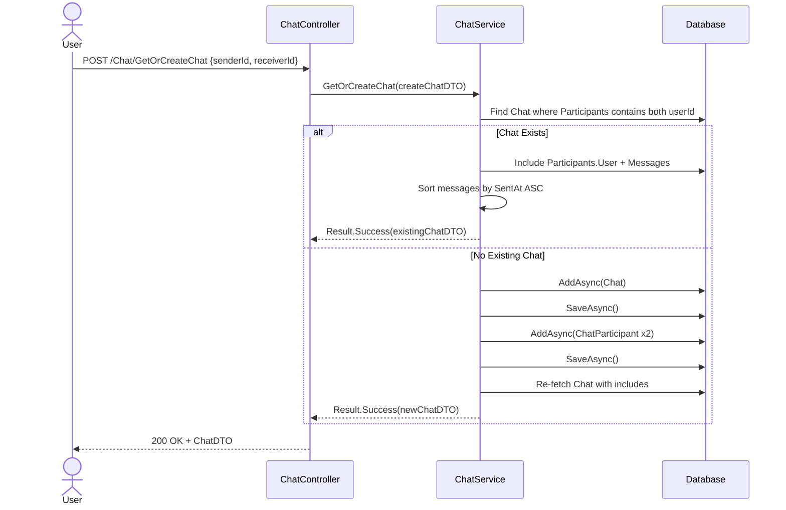
```mermaid
sequenceDiagram
    actor User
    participant API as ChatController
    participant Svc as ChatService
    participant DB as Database

    User->>API: POST /Chat/GetOrCreateChat {senderId, receiverId}
    API->>Svc: GetOrCreateChat(createChatDTO)
    Svc->>DB: Find Chat where Participants contains both userId
    alt Chat Exists
        Svc->>DB: Include Participants.User + Messages
        Svc->>Svc: Sort messages by SentAt ASC
        Svc-->>API: Result.Success(existingChatDTO)
    else No Existing Chat
        Svc->>DB: AddAsync(Chat)
        Svc->>DB: SaveAsync()
        Svc->>DB: AddAsync(ChatParticipant x2)
        Svc->>DB: SaveAsync()
        Svc->>DB: Re-fetch Chat with includes
        Svc-->>API: Result.Success(newChatDTO)
    end
    API-->>User: 200 OK + ChatDTO
```

### Sequence Diagram — Send Message (SignalR)
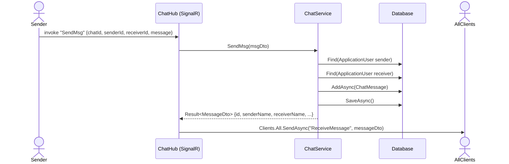
```mermaid
sequenceDiagram
    actor Sender
    participant Hub as ChatHub (SignalR)
    participant Svc as ChatService
    participant DB as Database
    actor AllClients

    Sender->>Hub: invoke "SendMsg" {chatId, senderId, receiverId, message}
    Hub->>Svc: SendMsg(msgDto)
    Svc->>DB: Find(ApplicationUser sender)
    Svc->>DB: Find(ApplicationUser receiver)
    Svc->>DB: AddAsync(ChatMessage)
    Svc->>DB: SaveAsync()
    Svc-->>Hub: Result<MessageDto> {id, senderName, receiverName, ...}
    Hub->>AllClients: Clients.All.SendAsync("ReceiveMessage", messageDto)
```

### Business Rules
- Chat is created once between two users (idempotent `GetOrCreate`)
- `GetAllChats` filters out the requesting user from participants list and returns only the **last message**
- Messages soft-deleted via `IsDeleted = true`
- SignalR connection requires `userId` query param for user-based routing

---

## Flow 9: Provider Rating

### Description
Customers rate service providers after job completion. Ratings are 1–5 in 0.5 increments. Average rating is computed on-demand.

### Sequence Diagram — Add Rating
```mermaid
sequenceDiagram
    actor Customer
    participant API as ProviderRatingController
    participant Svc as ProviderRatingService
    participant DB as Database

    Customer->>API: POST /ProviderRating/AddProviderRating {providerId, rate, comment, customerId}
    API->>Svc: AddProviderRating(providerRatingDTO)
    Svc->>Svc: Adapt via Mapster → Rate.Create(value) validates 1-5, step 0.5
    alt Invalid Rate
        Svc-->>API: ArgumentException thrown
        API-->>Customer: 400 BadRequest
    else Valid Rate
        Svc->>DB: AddAsync(ProviderRates)
        Svc->>DB: SaveAsync()
        Svc-->>API: Result.Success(ProviderRatingDTO)
        API-->>Customer: 200 OK
    end
```

### Activity Diagram — Average Rating
```mermaid
flowchart TD
    A[GET /ProviderRating/GetAverageRates/providerId] --> B[GetProviderRatings providerId]
    B --> C[Filter: ProviderId==id AND IsDeleted==false]
    C --> D[Include Provider.User + Customer.User]
    D --> E[List-ProviderRatingDTO]
    E --> F[Average of Rate values]
    F --> G[200 OK + decimal average]
```

### Business Rules
- Rate value must be between **1.0 and 5.0** in **0.5 increments** (enforced by `Rate` value object)
- Only **Customers** can add/update/delete ratings
- Only **Providers** can view their own ratings
- Soft-delete: `IsDeleted = true`
- `Rate.Average()` rounds to nearest integer via `Math.Round`

---

## Cross-Cutting Concerns

### Rate Limiting Policy Summary
| Policy | Limit | Window | Applied To |
|---|---|---|---|
| `AuthPolicy` | 5 req | 1 min | Login, Register, ForgotPassword |
| `GeneralPolicy` | 30 req | 1 min | Most API endpoints |
| `PaymentPolicy` | 3 req | 5 min | Charge Wallet |

### Caching Strategy
```mermaid
flowchart LR
    A[Request hits endpoint with CacheableAttribute] --> B{Cache hit by path+query?}
    B -- Yes --> C[Return cached OkObjectResult]
    B -- No --> D[Execute handler]
    D --> E[Store result in cache 10min]
    E --> F[Return fresh result]
```

### Security Model
```mermaid
flowchart TD
    A[Request] --> B[JWT Bearer Auth]
    B --> C{Token Valid?}
    C -- No --> D[401 Unauthorized]
    C -- Yes --> E{Role Authorized?}
    E -- No --> F[403 Forbidden]
    E -- Yes --> G[Rate Limiter Check]
    G --> H{Limit exceeded?}
    H -- Yes --> I[429 Too Many Requests]
    H -- No --> J[Process Request]
```

### Wallet Money Flow Summary
```mermaid
flowchart LR
    EXT[External Payment] -->|Callback| CW[Customer Wallet]
    CW -->|Accept Order| PW[Platform Wallet - Escrow]
    PW -->|Complete Order 90%| PRW[Provider Wallet]
    PW -->|Cancel Order 100%| CW
    PRW -->|Withdraw| MOB[Mobile Number]
    style PW fill:#f9f,stroke:#333
```